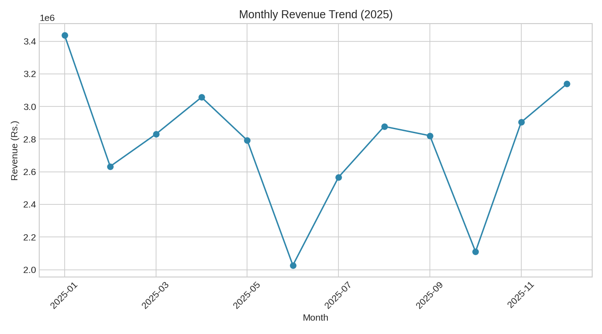
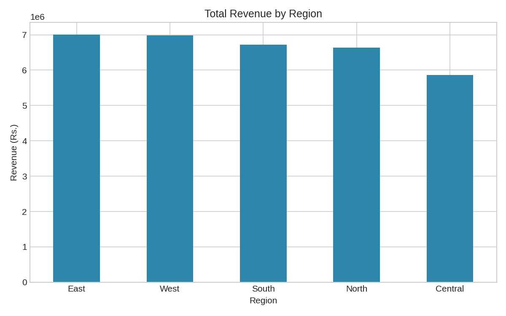

# Retail Sales Performance Analysis

A small end-to-end data analysis project I built to practice the full workflow I'd use on the job — messy raw data in, a proper cleaning pass, then SQL + Python analysis, and finally charts that could go straight into a dashboard.

I generated a year's worth of synthetic retail order data (Jan–Dec 2025) across 5 regions, 5 product categories and 3 customer segments, deliberately made it messy (duplicates, missing values, inconsistent text, a few bad entries), and then cleaned and analyzed it the way I would a real export from a company's POS or e-commerce system.

**Author:** Uday Patel
📧 udaypatel1116@gmail.com | 📍 Bhopal, Madhya Pradesh

---

## Why this project

I wanted something on my GitHub that actually shows the *process* — not just a finished chart, but the messy data before it, the cleaning logic, and the reasoning behind each step. That's most of what a Data Analyst role actually looks like day to day.

## What's inside

```
retail-sales-analysis/
├── data/
│   ├── raw_sales_data.csv        # Messy, uncleaned export (the "before")
│   └── cleaned_sales_data.csv    # Analysis-ready data (the "after")
├── src/
│   ├── generate_raw_data.py      # Creates the synthetic raw dataset
│   ├── clean_data.py             # All the data cleaning logic
│   └── analyze_sales.py          # EDA + chart generation + printed insights
├── sql/
│   └── sales_queries.sql         # 9 SQL queries (aggregations, rankings, window functions)
├── visuals/
│   ├── monthly_revenue_trend.png
│   ├── revenue_by_region.png
│   ├── revenue_by_category.png
│   ├── top_products.png
│   └── segment_share.png
├── requirements.txt
└── README.md
```

## The data cleaning step (the part I actually care about)

The raw file has the kind of problems you'd genuinely run into:

- Inconsistent text casing and stray whitespace (`" electronics "` vs `Electronics`)
- ~25 duplicate order rows, as if the export ran twice
- Missing values in `unit_price`, `units_sold`, `customer_segment`, and `payment_mode`
- A few negative `units_sold` values from data-entry errors
- Revenue not recalculated for rows where price/units were missing

`src/clean_data.py` handles each of these explicitly rather than just dropping every row with a gap — text is standardized, duplicates removed by `order_id`, negative units corrected, missing numeric values imputed sensibly (median by product/category), and revenue is recomputed from the cleaned numbers. 1,225 raw rows go in, 1,200 clean rows come out.

## Key insights (from this run)

- **Total revenue:** ₹3.32 crore across 1,200 orders
- **Avg. order value:** ₹27,663
- **Best month:** January 2025, weakest: June 2025
- **Top region:** East
- **Top category:** Electronics, driven largely by Power Bank sales
- **Wholesale** is the leading customer segment at 35% of revenue

*(Since the dataset is randomly generated, your numbers will differ slightly each time you regenerate it — the point is the pipeline, not these exact figures.)*

## How to run it

```bash
# 1. Clone the repo
git clone https://github.com/<your-username>/retail-sales-analysis.git
cd retail-sales-analysis

# 2. Install dependencies
pip install -r requirements.txt

# 3. Generate the raw (messy) dataset
python src/generate_raw_data.py

# 4. Clean it
python src/clean_data.py

# 5. Run the analysis and generate charts
python src/analyze_sales.py
```

Charts land in `visuals/`, and the SQL in `sql/sales_queries.sql` can be run against `cleaned_sales_data.csv` in SQLite, MySQL, or Postgres (load the CSV into a table named `sales` first).

## Sample output

**Monthly Revenue Trend**



**Revenue by Region**



## Tools used

- **Python** (pandas, numpy, matplotlib) — cleaning, analysis, visualization
- **SQL** — aggregations, ranking, and window functions
- **Excel / Power BI** — the same cleaned CSV can be loaded straight into Power BI for an interactive dashboard version (my `Sales Dashboard Analysis` project does exactly this)

## What I'd add next

- Load the cleaned data into an actual Power BI dashboard with slicers for region/segment
- Add a simple demand-forecasting model (e.g., a basic time-series model on monthly revenue)
- Automate the pipeline with a small Makefile or a scheduled script

---

If you have feedback or spot something I could do better, I'd genuinely like to hear it — feel free to open an issue or reach out directly.
