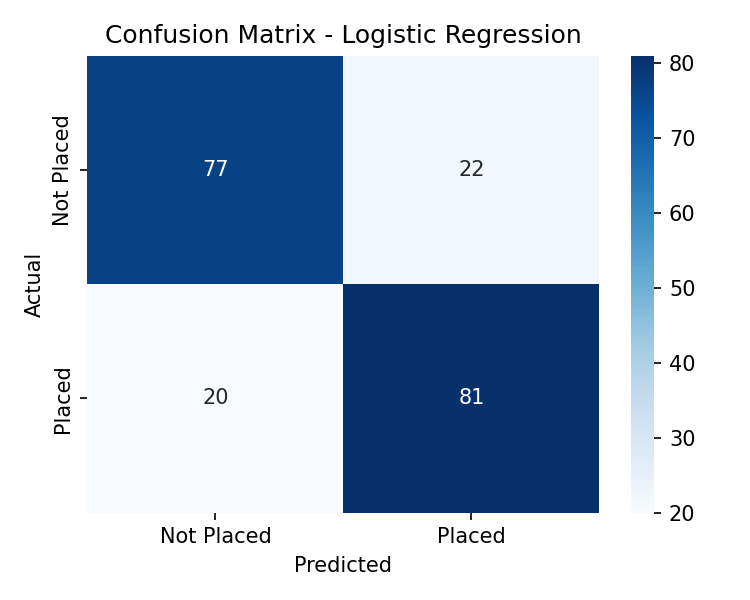
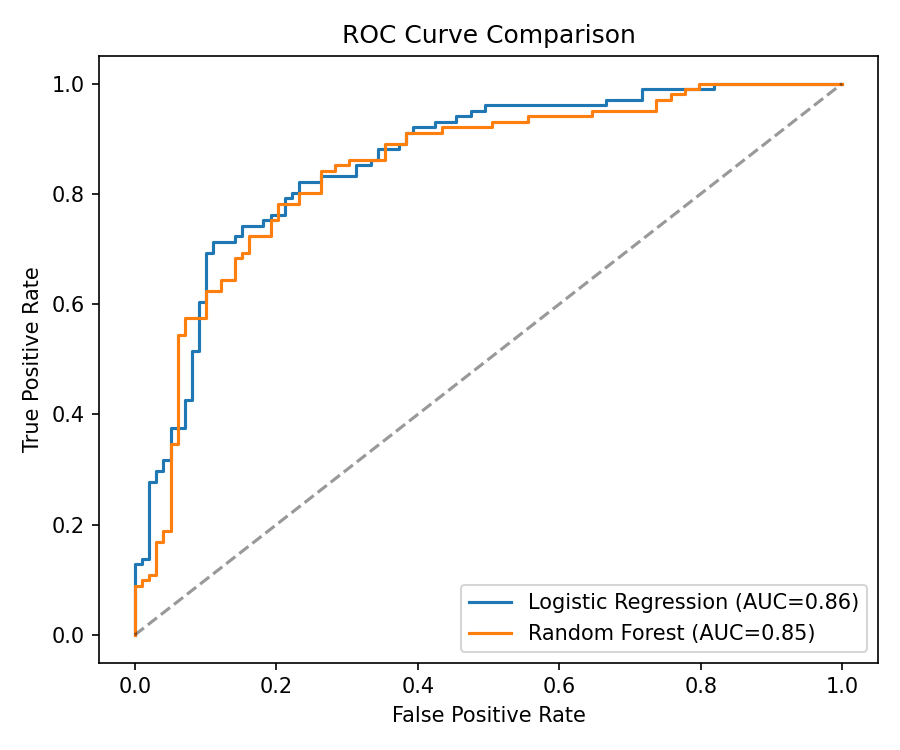
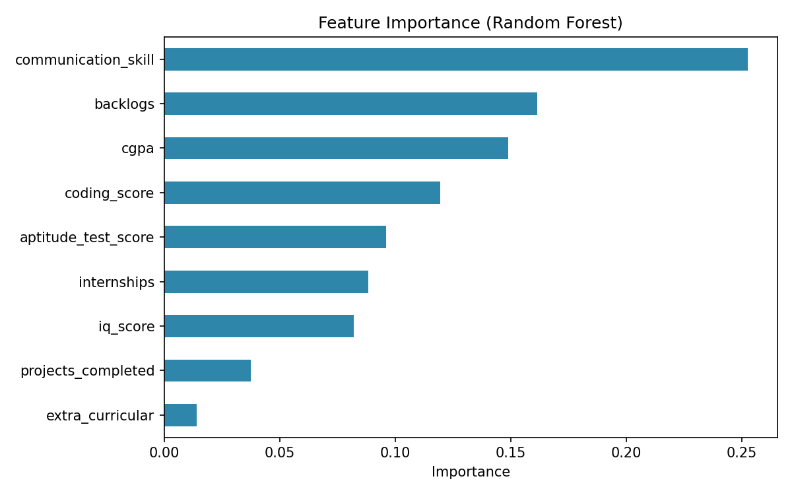

# Student Placement Prediction Model

Ek machine learning project jo college students ke academic performance aur skills ke basis par predict karta hai ki unka placement hoga ya nahi. Maine ye banaya taaki apne Data Science skills ko ek end-to-end classification problem par practically apply kar sakoon — data generation se lekar model training, evaluation, aur ek interactive app tak.

**Author:** Uday Patel
📧 udaypatel1116@gmail.com | 📍 Bhopal, Madhya Pradesh

---

## Project ka idea

Placement cells ke paas typically student ka CGPA, internships, coding scores, communication skills jaisa data hota hai. Is project me maine synthetic (realistic) data generate kiya hai jisme placement outcome in factors se genuinely correlated hai — fir do classification models train kiye, unhe compare kiya, aur best model ko ek Streamlit app ke through usable bana diya.

## Project structure

```
placement-prediction-model/
├── data/
│   └── placement_data.csv        # 1000 students ka synthetic dataset
├── src/
│   ├── generate_data.py          # Dataset generate karta hai
│   ├── train_model.py            # Models train, evaluate, aur save karta hai
│   ├── recommend.py              # Skill-gap recommendation engine
│   └── predict.py                # Command-line se single prediction + recommendations
├── app/
│   └── app.py                    # Streamlit web app (interactive form)
├── models/
│   ├── placement_model.pkl       # Trained model (best performer)
│   ├── scaler.pkl                # Feature scaler
│   ├── model_name.pkl            # Kaunsa model use ho raha hai
│   ├── placed_medians.pkl        # Placed students ke benchmark values (recommendations ke liye)
│   └── feature_importance.pkl    # Feature importance weights (recommendations ke liye)
├── visuals/
│   ├── confusion_matrix.png
│   ├── roc_curve.png
│   └── feature_importance.png
├── requirements.txt
└── README.md
```

## Features used for prediction

| Feature | Description |
|---|---|
| `cgpa` | Overall CGPA (out of 10) |
| `iq_score` | IQ test score |
| `communication_skill` | Self/HR rated communication skill (1–10) |
| `internships` | Number of internships completed |
| `projects_completed` | Number of academic/personal projects |
| `coding_score` | Coding test score (out of 100) |
| `backlogs` | Current active backlogs |
| `extra_curricular` | Active in extra-curriculars (0/1) |
| `aptitude_test_score` | Aptitude test score (out of 100) |

## Models compared

Maine do models train aur compare kiye:

| Model | Accuracy | Precision | Recall | F1 Score | ROC AUC |
|---|---|---|---|---|---|
| Logistic Regression | 0.79 | 0.79 | 0.80 | **0.79** | 0.86 |
| Random Forest | 0.78 | 0.78 | 0.78 | 0.78 | 0.85 |

Logistic Regression ne thoda better F1 score diya, isliye woh final model ke roop me saved hai (`models/placement_model.pkl`). Random Forest se feature importance bhi nikala gaya hai interpretability ke liye.

**Sabse important features:** communication skill, backlogs, CGPA, aur coding score — ye chaaro sabse zyada asar dikhate hain placement outcome par.

## Visuals

**Confusion Matrix**


**ROC Curve Comparison**


**Feature Importance**


## 🆕 New Feature: Skill Improvement Recommendations

Agar prediction "Not Placed" aata hai, to project sirf ruk nahi jaata — ye **exactly batata hai kya improve karna hai**:

1. Student ki har value ko placed-students ke median/average se compare karta hai
2. Jin areas me student sabse zyada peeche hai (aur jo feature sabse zyada important hai — Random Forest ke feature importance se), unhe priority order me nikalta hai
3. Top 4 improvement areas ke liye specific, actionable advice deta hai (jaise: "coding score kam hai → LeetCode par daily practice karo")

Ye dono jagah kaam karta hai — command-line (`predict.py`) aur Streamlit app dono me.

**Example output:**
```
📌 Improve karne ke liye sabse important areas (priority order me):

1. Coding Skills
   Aapka value: 45.0 | Placed students ka average: 66.8
   Suggestion: Coding test score average se kam hai. LeetCode/HackerRank
   par daily 2-3 problems solve karo, DSA par strong focus rakho...

2. Aptitude Test Score
   ...
```

Logic `src/recommend.py` me hai — `models/placed_medians.pkl` (placed students ke benchmark values) aur `models/feature_importance.pkl` (kaunsa feature kitna matter karta hai) training ke time generate hote hain.

## Kaise chalayein

```bash
# 1. Repo clone karo
git clone https://github.com/<your-username>/placement-prediction-model.git
cd placement-prediction-model

# 2. Dependencies install karo
pip install -r requirements.txt

# 3. Dataset generate karo
python src/generate_data.py

# 4. Model train karo
python src/train_model.py

# 5a. Command line se single prediction lo
python src/predict.py

# 5b. Ya interactive web app chalao
streamlit run app/app.py
```

Streamlit app browser me khulega jahan aap sliders/inputs se apni details daal ke turant placement probability dekh sakte ho.

## Tools used

- **Python** — pandas, numpy for data handling
- **scikit-learn** — Logistic Regression, Random Forest, evaluation metrics
- **matplotlib, seaborn** — visualizations
- **Streamlit** — interactive web app
- **joblib** — model serialization

## Limitations (honestly likhna zaroori hai)

- Dataset synthetic hai — real placement records par accuracy alag ho sakti hai
- Model sirf 9 features par based hai; real world me branch, college tier, aur soft factors bhi matter karte hain
- ~79% accuracy demo ke liye theek hai, production-grade nahi

## Aage kya add karunga

- Real anonymized placement dataset par retrain karna (agar mil jaye)
- Hyperparameter tuning (GridSearchCV) accuracy improve karne ke liye
- SHAP values add karna better model explainability ke liye
- App ko Streamlit Cloud par deploy karna taaki live link share kar sakoon
- Recommendation engine ko aur granular banana (e.g., specific resources/courses link karna har suggestion ke saath)
- Time-based tracking add karna — student apna progress track kar sake (before/after improvement)

---

Feedback ya suggestions ho to issue open karo ya directly reach out karo.
